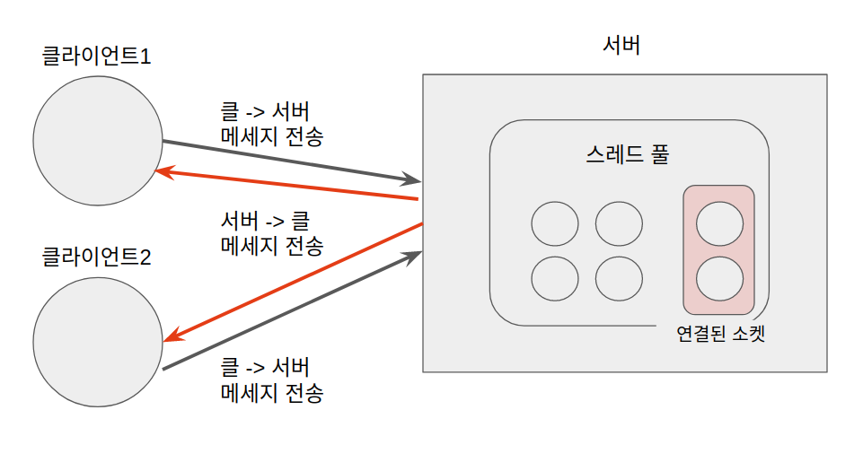

# Java Socket Practice

본 자료는 자바 기반의 소켓 프로그래밍입니다.

제대로 된 예제를 실행하기 위해서는 제 [Github](https://github.com/griffinGC/java_socket_practice) 소스코드를 참고해 주세요

소스코드 실행 순서는 ServerTest -> ClientTest1,2 순서로 실행하시면 cli에서 확인하실 수 있습니다.

### 동작 방식

- 서버
  1. 서버 실행
     - cpu 코어 수 만큼 스레드 생성
  2. 클라이언트가 접속할때까지 대기
     - 접속시 커넥션 리스트에 추가
  3. 클라이언트가 서버에 접속
  4. 클라이언트가 메세지 전송
     - 서버에 연결된 모든 클라이언트에게 다시 메세지 전달
- 클라이언트
  1. 서버에 접속
     - 접속과 동시에 계속 받기 위해 대기 중
  2. 메세지 전송
     - 서버로 메세지 전송

### 사용한 라이브러리

- 입출력 관련
  - InputStream
  - OutputStream
- 소켓 관련
  - InetSocketAddress
  - ServerSocket
  - Socket
- 스레드 세이프 관련
  - Vector
- 스레드 관련
  - ExecutorService
  - Executors

### 참고자료

- 이것이 자바다